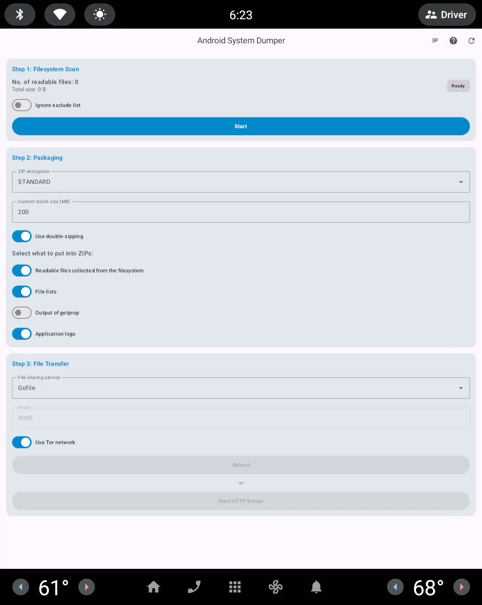
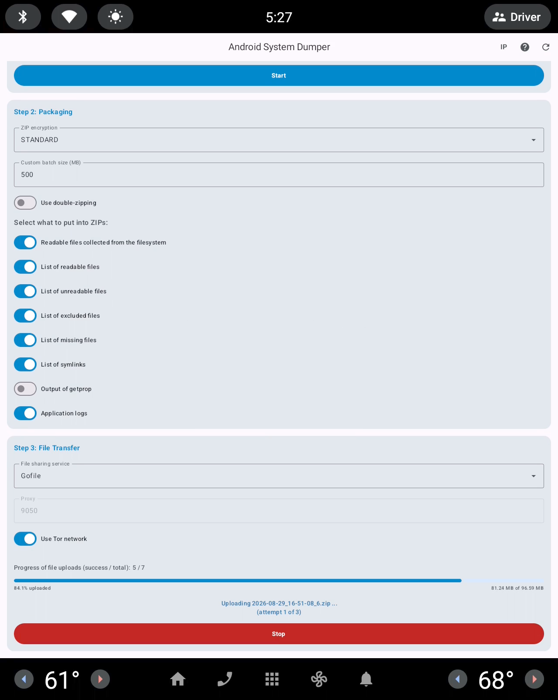
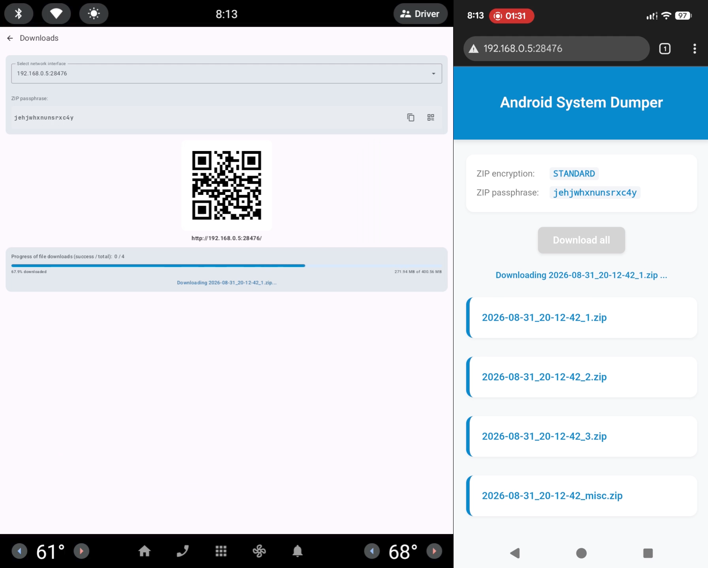

# Android System Dumper

This is a vulnerability research helper tool designed to collect and securely share system-level parts of the filesystem of Android devices. It is useful on platforms where neither ADB nor root access is available. It doesn't use any storage related permissions, so it only finds files that literally **any** app (e.g. in the Play Store) could. No manufacturer can argue that this app does any "hacking" or illegal (without admitting their own absolute incompetence as far as cybersecurity is involved), thus it's safe to use on any device without the fear of voiding any warranties. Of course this is not a legal statement :), just my personal opinion.



## Features

- **Filesystem scan**: Recursively scans the filesystem for readable files, processes the contents of well-known configuration files to discover additional file paths (e.g. notice.xml, SELinux context files, fstab files, modules.(dep|load), etc.).
- **Privacy exclusions**: No Android storage permissions are declared or used, thus the OS itself prevents access to any user data. As an additional privacy measure, the filesystem scanner skips paths that match a predefined exclusion list (with known locations where user data might be stored).
- **Secure archiving**: Packages collected data into encrypted (or optionally plain) ZIP archives using [Zip4j](https://github.com/srikanth-lingala/zip4j).
- **File transfer**: Both uploads (via internet connection) and downloads (via local network) are supported.
- **Anonymous uploading**: Integrated support for the **Tor** network (through the Guardian Project's [tor-android](https://github.com/guardianproject/tor-android) and [jtorctl](https://github.com/torproject/jtorctl)) allows anonymous upload of dumps to services like [Gofile](https://gofile.io/) and [Filebin](https://filebin.net/).
- **IP privacy verification**:
  - If "Use Tor network" is selected, a request to https://check.torproject.org/api/ip automatically verifies at the start of uploads that all requests are actually routed through the Tor network. Upload is canceled if this check fails.
  - The "IP Information" screen allows you to "manually" verify that traffic is correctly routed through the Tor network (using third-party GeoIP services like [json.geoiplookup.io](https://json.geoiplookup.io/) and [ipwho.is](https://ipwho.is/)). The Tor service uses different circuits for every host you connect to, so it's very likely that the file sharing services will see a different exit node than what these GeoIP services see. If "Use Tor network" is disabled, you'll see info on your own IP.
- **HTTP Server**: for the (direct) device <-> device file transfers an HTTP Server is started and the URL (to connect to) is presented via QR code.
- **QR code sharing**: Generates QR codes (using [ZXing](https://github.com/zxing/zxing)) for the download URL and the ZIP encryption passphrase (useful on devices where these would be difficult to export otherwise, such as devices running AAOS).
- **Modular architecture**: Built with Clean Architecture principles (including Google's [architecture guidelines](https://developer.android.com/topic/architecture)) to ensure scalability and maintainability.
- **Device support**: Built to be compatible with both standard Android devices and Android Automotive OS (AAOS).

## Usage

### Step#1: Scans the filesystem

The app has a list of built-in paths that it uses as the roots for the recursive filesystem scan. It also has a list of paths (well-known to contain user data) to exclude from the scan in case access to any of the discovered paths are for some reason is not prevented by the OS itself.

Some files (mostly configuration files found during the recursive scan) are analyzed to gather paths that the recursive scan itself could not find.

### Step#2: Packaging parameters

The collected files are packaged into ZIP archives. The app provides lots of options to control the ZIP creation parameters (encryption, total file size for ZIP inputs, etc.) and the contents of the ZIPs.

### Step#3: File transfer

The app provides two ways to get the ZIP archives off the device:

- Upload: This uploads the ZIPs to a public (temporary) file sharing service. Both supported services host the uploaded files only for a short time period.
- Download: The app starts an HTTP server which serves a self-contained HTML with the ZIP index and a provides a "Download All" button for convenience. It's the user's task to set up the connection between the two devices (the one running this app and the other that downloads the files, e.g. a phone running a web browser). Usually this can be done by creating a Wi-Fi hotspot on the downloading device (phone) and connecting to this hotpost from the device (car head unit, TV, etc.) that runs this app.

## Privacy

The default settings of the app provide reasonable privacy for the upload scenario.

Standard ZIP files don't allow the encryption of the central directory, thus the list of included files is always visible even without knowing the passphrase or cracking the encryption.

To work around this problem, you can enable the "Use double-zipping" option. This will first package the collected files into a plain (i.e. not encrypted) ZIP with compression, then package this ZIP into another ZIP with encryption and no compression. Based on my tests double-zipping is not slower in upload scenarios and the difference in running time for downloads is negligible (e.g. 62s vs. 57s).

This feature prevents e.g. the file sharing service (where the app uploads the ZIPs) from looking even at the file listing in the ZIPs' central directories. Also, double-zipping might provide some level of protection against known-plaintext attacks on the standard ZipCrypto encryption.

If you want maximum privacy, switch the encryption method to AES, but you might need a third-party app to decrypt the ZIPs (e.g. Windows 11 doesn't support AES encrypted ZIPs out-of-the-box).

## Demo

Here's a video of the upload process:

[](https://www.youtube.com/watch?v=878IzMO6CiQ)

And here's a video of the download process, showing the side-by-side screens of an emulated target device and a phone (used as a downloader):

[](https://www.youtube.com/watch?v=4zX-aR7sUuw)

## Prerequisites

- **Minimum Android version**: Android 8.0 "Oreo" (API level 26).
- **Supported platforms**:
  - **Mobile**: Android smartphones and tablets.
  - **Automotive**: Android Automotive OS (AAOS) head units.
- **Supported ABIs**:
  - `armeabi-v7a`
  - `arm64-v8a`
  - `x86`
  - `x86_64`
- **Hardware requirements**: An active Internet connection (Wi-Fi or mobile data) is required for Tor and uploading features.
- **Note**: The application has **not** been tested on Android TV devices with a TV remote; UI navigation may be inconsistent on this platform.

## Installation

**Important Note**: If you have full ADB access to your device, this application may not be necessary for your needs, as `adb bugreport` and other methods (e.g. shell script run via `adb shell`) offer similar access, often with wider reach. This tool is primarily intended for scenarios where ADB/root is unavailable.

To install the application:

- **Sideloading**: Obtain the APK from a trusted source (this GitHub project or compile it yourself) and sideload it using your device's file manager or any other available sideloading mechanism.
- **Google Play Internal Testing**: If you are part of an authorized Internal Testing group, you can install the app via the Google Play Store's Internal Testing track.
  - You can reach out to me via a GitHub issue and I might be able to include you in my Internal Testing group (if I still have free slots available).
  - Set up your own Internal Testing track:
    - Register a Google developer account.
    - Compile the application with a unique `applicationId` into an AAB.
    - Publish it on Google Play using the Internal Testing track.
    - Add the target Google account to the tester group.
    - Install the app via the invitation.

## Effectiveness

On a production Volvo head unit the app could read 5845 files (3432.7 MB) and failed to read only 430 files (241.5 MB). That's 93.1% of all files by count and 93.4% by size.

A large part (293, i.e. 68.1%) of the unaccessible files are in:

- /system/bin
- /vendor/bin

The rest is distributed among multiple directories.

## Development

### Principles & Structure

The app follows (more or less) **Clean Architecture** and [**SOLID**](https://en.wikipedia.org/wiki/SOLID) principles, utilizing a multi-module Gradle setup:

- **`:domain`**: A pure Kotlin module containing business logic, entities, and repository interfaces. It is independent of the Android framework.
- **`:app`**: An Android library module that contains the Jetpack Compose UI, ViewModels, and shared Android-specific implementations.
- **`:mobile`**: The application module targeting standard Android devices.
- **`:automotive`**: The application module targeting AAOS (Android Automotive OS) devices, specifically tested on several Volvo head units.

For now almost all of the app is contained in the `app` and `domain` modules, but the architecture would allow separate UI implementation for AAOS devices. If someone wanted to publish this app on Google Play (which may be possible given that it does not require any dangerous permissions), the AAOS UI could be rewritten to use the [Templates Host feature](https://developer.android.com/training/cars/apps/automotive-os).

### Third-Party Libraries

These are some of the major libraries used:
 
- **Tor (Guardian Project)**: Provides anonymity for network requests.
- **Zip4j**: Handles robust ZIP archive creation with encryption (including AES).
- **ZXing**: Used to generate QR codes for sharing upload results.
- **Hilt**: Dependency injection framework.
- **Retrofit & OkHttp**: Networking stack for HTTP API calls.
- **Moshi**: Modern JSON library for Kotlin/Java.
- **Room**: Local persistence for settings.

### Native Components (JNI)

The app utilizes a C++ library via **JNI** (`scanner_jni.cpp`) for high-performance filesystem scanning and low-level system interactions that are otherwise difficult to achieve in pure Kotlin/Java.

### Testing Environments

The application has a minimum line coverage requirement of 80% for all modules. [Kover](https://github.com/Kotlin/kotlinx-kover) is used to enforce this during test runs.

To run all checks (including all tests) in the app's directory:

```bash
./gradlew check
```

The application is actively developed and manually tested in the following environments:

- Android Studio emulator (multiple API levels starting with Android 9 / API Level 28).
- Google Pixel phone (Android 17).
- Volvo head units (AAOS 12 and above).

Note: the Android Studio emulator (starting with [35.2.10](https://developer.android.com/studio/emulator_archive)) has a bug, conflict, or regression affecting Android 8 based virtual devices, so regular testing is performed with an up-to-date emulator on Android 9 and later virtual devices. Before the initial release, the app has been tested with an older emulator version and an Android 8 based virtual device as well.

## Contributing

You can contribute in the following ways:

- **Issue tracker**: Please report bugs or suggest features through the [GitHub issue tracker](https://github.com/muzso/android_system_dumper/issues).
- **Pull requests**: Submit your changes as pull requests for review.
- **Security**: Use GitHub's [vulnerability reporting feature](https://github.com/muzso/android_system_dumper/security/advisories/new) to report security vulnerabilities.

## Build

The project is developed and tested using Android Studio on Ubuntu.

You can build APKs/AABs from the `mobile` and `automotive` modules.

The `app` module has different defaults for `debug` and `release` build variants to reduce the time necessary for manual upload tests:

- `BATCH_LIMIT`: `debug` builds upload only the first batch of collected readable files, `release` builds upload all batches.
- `DEFAULT_BATCH_SIZE_MB`: `debug` builds have a default batch size of 200 MB, `release` builds use 500 MB.

### Requirements
 
- Android SDK 37+
- Android NDK (for JNI components)

### Build Targets

You can build the application for different platforms using the following modules:
- **Mobile**: Build the `:mobile` module for standard Android devices.
- **Automotive**: Build the `:automotive` module for AAOS devices.

To build an APK from the command line:

```bash
./gradlew :mobile:assembleRelease

./gradlew :automotive:assembleRelease
```

## Debugging

### Logging

Android System Dumper features comprehensive logging to both the standard Android System Log (Logcat) and a local file for persistent storage.

- **System Logs**: View real-time logs via `adb logcat` (disabled for `release` builds via BuildConfig).
- **File Logs**: Logs are stored in the application's cache directory at `cacheDir/logs.txt`.
- **Log Export**: The application has an option in the upload settings to include the `Application logs` in the system dump, allowing for remote debugging.

## License

This project is licensed under the **BSD-3-Clause** license. See the `LICENSE` file for more details.
